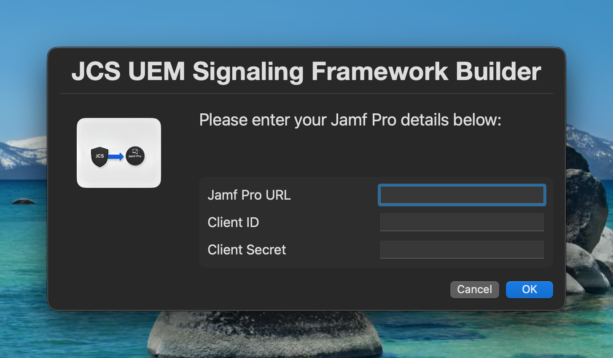
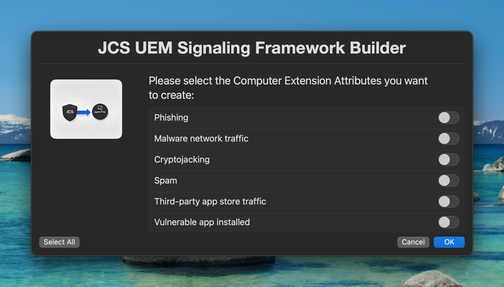
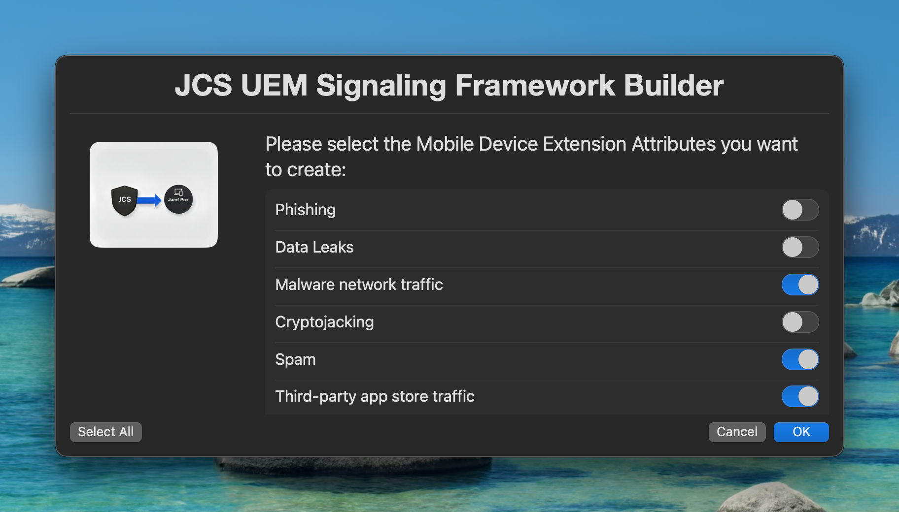
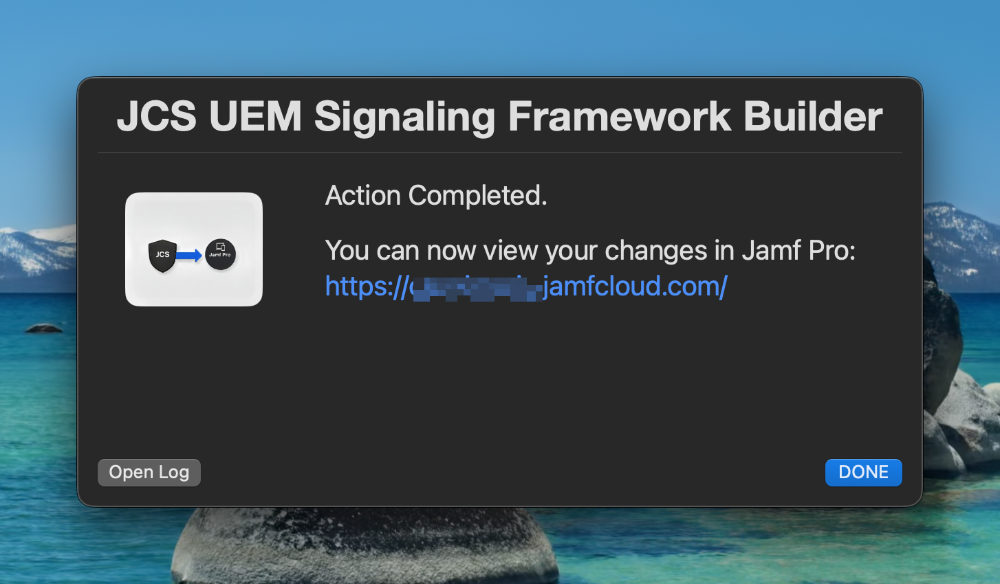

# UEM Signaling Framework Builder
A tool to help build and manage the UEM Signaling Framework in Jamf Pro.
- UEM Signaling tags in JSC: https://learn.jamf.com/en-US/bundle/jamf-protect-documentation/page/Configuring_UEM_Signaling_to_Control_Tethering_via_Jamf_Pro.html

This tool creates the necessary Smart Groups, Policies, and Scripts in Jamf Pro to implement the UEM Signaling Framework.

## Features
- Create Extension Attributes for UEM Signaling tags.
- Creates Smart Groups for each UEM Signaling tag.

## images




## Usage
   ```bash
   chmod +x UEM_Signaling_Framework_Builder.sh
   ```
2. Run the script:
   ```sh
   ./UEM_Signaling_Framework_Builder.sh
   ```
3. Follow the prompts to enter your Jamf Pro URL, API credentials, and other configuration options.

Optional:
Enter your Jamf Pro API credentials as environment variables to avoid being prompted each time you run the script:
Variable names:
- JAMF_PRO_URL
- JAMF_CLIENT_ID
- JAMF_CLIENT_SECRET


## Requirements
- Access to the Jamf Pro API
- Jamf Pro API credentials (client ID and client secret)
- jq (JSON processor) (Default on macOS versions 10.15 and later)
- bash (or compatible shell
- API permissions:
  - Computer Extension Attributes: Create, Read
  - Mobile Device Extension Attributes: Create, Read
  - Computer Groups: Create, Read
  - Mobile Device Groups: Create, Read

## Logging
The script logs its actions and any errors to a log file located at `~/Library/Logs/UEM_Signaling_Framework_Builder.log`.
You can view the log file for troubleshooting and auditing purposes.
## Variables
All variables are configurable optionally! They have default values and don't need to be changed if you are happy with the defaults.
